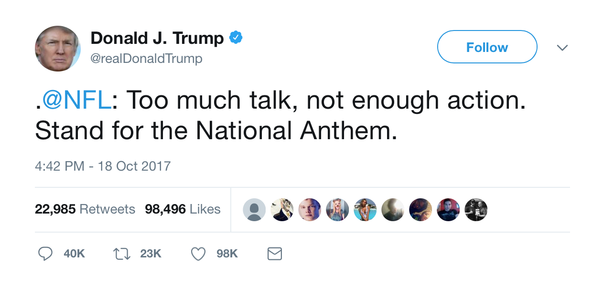
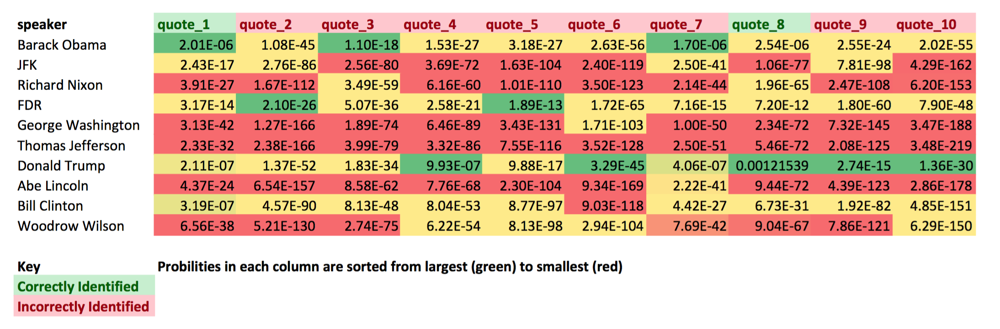
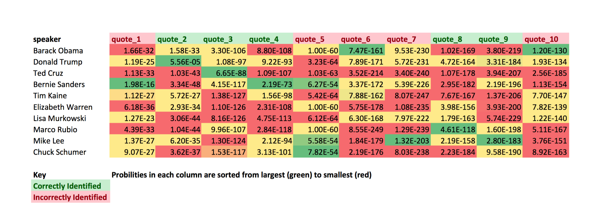

\newcommand{\argmax}{\mathop{\rm arg\,max}}

# Introduction
History remembers great speakers for their idiosyncracies. From JFK's authenticity and passion to Donald Trump's divisive rhetoric, U.S. presidents are particularly identifiable by their speeches. While nearly any citizen can name the presidents who said "Nothing to fear but fear itself" (Franklin Delano Roosevelt), "Ask not what your country can do for you--ask what you can do for your country" (John F. Kennedy), and "Yes We Can!" (Barack Obama), it remains to be seen whether a language model can do the same. Our project aims to build a language model that determines the most likely speaker of a given input quote. Morover, our project seeks to investigate how the model discernability changes when trained on three types of data: presidential speeches, part of speech tags for presidental speechs, and politicans' tweets.

# Methodogy
### Data Sources
Speeches from each of the 44 presidents and 2016 Democratic Nominee Hillary Clinton were obtained from on open source online corpus compiled by [The Grammar Lab](http://www.thegrammarlab.com/?nor-portfolio=corpus-of-presidential-speeches-cops-and-a-clintontrump-corpus). Tweets from Presidents Donald Trump and Barack Obama and various Senators were collected from [data made public by FiveThirtyEight](https://github.com/fivethirtyeight/data/tree/master/twitter-ratio).

### Data Cleaning
Tweets were parsed and tokenized before using the model. All words were lowercased so that various capitalization wouldn't affect the results. All punctuation (including commas) was removed from tweets and was replaced with beginning and end of sentence speech tags (\<s\> and \</s\>). Given that tweets can be quoted (in the form of a hyperlink to said tweet), everything after (and including) the text pattern "http" was removed when such a pattern appeared in a tweet. Additionally, Twitter offers users the option to share or "Retweet" posts that other users have made. Since retweets, indicated in our corpus by RT, aren't necessarily direct words from a given user, all retweets were removed from the training corpus. When all is said and done, this tweet  is represented as follows:

['\<s\>', u'\@nfl', u':', u'too', u'much', u'talk', u'not', u'enough', u'action', '\</s\>', '\<s\>', u'stand', u'for', u'the', u'national', u'anthem', '\</s\>']

Presidential speechs were cleaned in a manner that matched the output of the tweet parser. That is, all punction marks were removed and sentences were marked with appropriate tags. The first two lines of each document was removed as it provided the name and date of each speech. A few speechs were transcripts of interviews, and thus had reporter questions that were not presidential text. Given that these interjections were infrequent and could not be easily removed with regular expressions, we decided to leave them in with the assumption that they would not change any bi-gram or tri-gram probabilities in a significant way.

### Fitting the Model
The model we choose to implement is an $n$-gram model with $n = 2$. To deal with the issue of unseen counts, we use Good-Turing Smoothing, explained in more detail below. Bigram and Trigram counts are computed from the various training corpuses. We will use three different types of data to train the model in order to see if any type of data works best. They are as follows:

1. Text from presidential speech corpus.

2. Part of speech tags from presidential speech corpus.

3. Tweet text from Obama, Trump and several U.S. senators. 

Since the corpus of presidential speeches does not come with POS tags, we use a Hidden Markov Model to compute the most likely tag sequence for each sentence. The HMM is trained on data from the Brown Corpus built into Python's Natural Language Toolkit library. 

### Good Turing Smoothing
The smoothing method chosen for this project was the simple Good Turing smoothing method. This discounting algorthim uses the frequency of singletons words or N-grams to estimate the frequency of zero count events. The Good Turing algorthim first computes $N_c$ or the number of N-grams that occur c times: 

$$
N_c = \sum{x:count(x)=c} = 1
$$

The intuition behind the algorithm is then to use the number of N-grams that occur c times to determine the probability of N-grams which occur c+1 times. The updated counts denoted by $c*$ are calculated using the following formula:

$$
c* = (c+1) \frac{N_{c+1}}{N_c}
$$

These new counts $c*$ are then used to replace the maxium likelihood counts for each $N_c$. The probability of a zero-count event according the Good Turing algorithm is calculated using the following equation:

$$
P(N-gram with zero-count) = \frac{N_1}{N}
$$

In this equation, $N_1$ is the number of counts seen once and N is the total number of counts seen in the training set of the model. 

An issue that arose when implementing this algorithm was that there were holes in the set of raw counts of counts $N_c$. Since the re-estimated value of a given $c*$ depends on $N_{c+1}$ these holes had to filled in with an estimation in order for the model to function. This was accomplished by using the Simple Good-Turing method proposed by (Gale and Sampson 1995). This method works by smoothing the unseen $N_c$ bins to replace all zeros. A linear regression function which maps the $N_c$ to c in log space was used for this smoothing:

$$
log(N_c) = a + blog(c)
$$

### Testing the Model
For each of the three types of training files, we have compiled a list of 10 quotes, each from a different speaker. The 10 possible speakers are then used as training files for the model. The probability of each quote for a given speaker is calculated as follows, using addition of logarithms to account for small probabilities.

$$
\mathbb{P}(Q) = \prod_{i = i}^{n} \mathbb{P}(w_i|w_{i-1}) = 2^{\sum_{i=1}^{n}\log_2(\mathbb{P}(w_i|w_{i-1})})
$$

After computing the probability of each sentence for all possibile speakers, we attribute to each quote the speaker that yields the highest probability for the given quote. That is, our model predicts the speaker $S$ of a quote $Q$ as follows:

$$
\hat S = \argmax_{s \in \text{ Possible Speakers}} \mathbb{P}(Q|s)
$$

# Results
## Presidential Speech Corpus
The probilities of each of the following presidential quotes were computed using the relavent speakers speechs as training files for the bigram model.

* Quote 1: \<s\> yes we can \</s\> - Barack Obama
* Quote 2: \<s\> and so my fellow Americans ask not what your country can do for you ask what you can do for your country \</s\> - JFK
* Quote 3: \<s\> when the president does it that means that it is not illegal \</s\> - Richard Nixon
* Quote 4: \<s\> the only thing we have to fear is fear itself \</s\> - FDR
* Quote 5: \<s\> liberty when it begins to take root is a plant of rapid growth \</s\> - George Washington
* Quote 6: \<s\> the care of human life and happiness and not their destruction is the first and only object of good government \</s\> - Thomas Jefferson
* Quote 7: \<s\> make america great again \</s\> -Donald Trump
* Quote 8: \<s\> a house divided against itself cannot stand \</s\> - Abraham Lincoln
* Quote 9: \<s\> we must teach our children to resolve their conflicts with words not weapons \</s\> - Bill Clinton
* Quote 10: \<s\> i would rather belong to a poor nation that was free than to a rich nation that had ceased to be in love with liberty \</s\> -Woodrow Wilson

Probability outputs for each speaker on each of the ten quotes are shown below in Figure 1. Overall, the model correctly identified 2/10 (50%) of the people who said these tweets. The two speakers that the model identified correctly were Barack Obama (quote 1) and Donald Trump (quote 7). Given that our model attributed 7 quotes to either Trump or Obama, this may be the result of larger training corupuses for these two presidents. For earlier presidents, our corpus contains fewer speeches than for more recent presidents. We have 50 Obama speeches in our data set compared to only 21 for George Washinton. Using more data for recent presidents likely yields fewer unseen bigrams, and thus higher probabilities. The most likely quote-speaker pair was Donald Trump "Make America Great Again", nearly 1000 times more probable than Obama's famous "Yes we Can!" slogan.

## Part of Speech Tags
The probilities of each of the following presidential quotes in POS tag form were computed using the relavent speakers speechs as training files for the bigram model.

* Quote 1: <s> ADV PRON VERB </s> - Barack Obama
* Quote 2: <s> CONJ ADV DET NOUN PRT VERB ADV DET DET NOUN VERB VERB ADP PRON VERB DET PRON VERB VERB ADP DET NOUN </s> - JFK
* Quote 3: <s> ADV DET NOUN VERB PRON ADP NOUN ADP PRON VERB ADV ADJ </s> - Richard Nixon
* Quote 4: <s> DET ADJ NOUN PRON VERB PRT VERB VERB VERB PRON </s> - FDR
* Quote 5: <s> NOUN ADV PRON VERB PRT VERB PRT VERB DET NOUN ADP ADJ NOUN </s> - George Washington
* Quote 6: <s> DET NOUN ADP ADJ NOUN CONJ NOUN CONJ ADV DET NOUN VERB DET ADJ CONJ ADJ NOUN ADP ADJ NOUN </s> - Thomas Jefferson
* Quote 7: <s> VERB NOUN ADJ ADV </s> - Donald Trump
* Quote 8: <s> DET NOUN VERB ADP PRON VERB NOUN </s> - Abe Lincoln
* Quote 9: <s> PRON VERB VERB DET NOUN PRT VERB DET NOUN ADP NOUN ADV NOUN </s> - Bill Clinton
* Quote 10 <s> PRON VERB ADV VERB ADP DET ADJ NOUN PRON VERB ADJ ADP ADP DET ADJ NOUN PRON VERB VERB PRT VERB ADP VERB ADP NOUN </s> - Woodrow Wilson

## Tweet Data
The probilities of each of the following tweets were computed using the relavent speakers' twitter history as training files for the bigram model.

* Quote 1: \<s\> yes we can \</s\> - Barack Obama
* Quote 2: \<s\> make america great again \</s\> - Donald Trump
* Quote 3 \<s\> stark reminder of the threat radical islamic terror still poses to our homeland \</s\> -Ted Cruz
* Quote 4: \<s\> it's not by giving massive tax breaks to your billionaire friends \</s\> - Bernie Sanders
* Quote 5: \<s\> tax bill equals swamp creature \</s\> - Tim Kaine
* Quote 6: \<s\> @SenBernieSanders & I are talking about things democrats are fighting for in this spending bill that would make a big difference to working families \</s\> - Elizabeth Warren
* Quote 7: \<s\> whether you are in the media politics or anywhere else abuse of power is unacceptable & shouldn’t be tolerated at any place at any level \</s\> - Lisa Murkowski
* Quote 8: \<s\> in a foreign relations committee hearing today i discussed how u.S. nuclear forces protect our nation and allies in the 21st century \</s\> - Marco Rubio
* Quote 9: \<s\> president trump did the people of utah a great favor today by rolling back harmful land use restrictions in southern utah \#utpol  \</s\> - Mike Lee
* Quote 10: \<s\> better \#GetCovered it’s the last weekend to sign up for 2018 health coverage before the 12/15 deadline \</s\> - Chuck Schumer

Probability outputs for each speaker on each of the ten quotes are shown below in Figure 3. Overall, the model correctly identified 5/10 (50%) of the people who said these tweets. The most likely tweet-speaker pair was Donald Trump "Make America Great Again". Interestingly, this combination was over 10,000,000,000 times more likely any other combination! While some of this discrepancy can be expained by the fact that it is a shorter tweet, it also speaks to the unprescedented manner in which President Trump uses Twitter compared to other politicians.

# Discussion